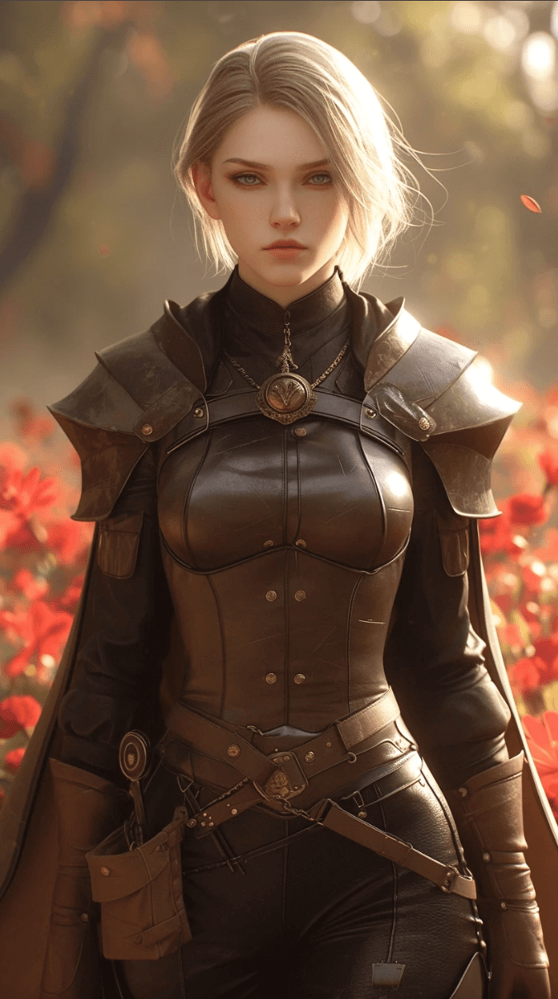
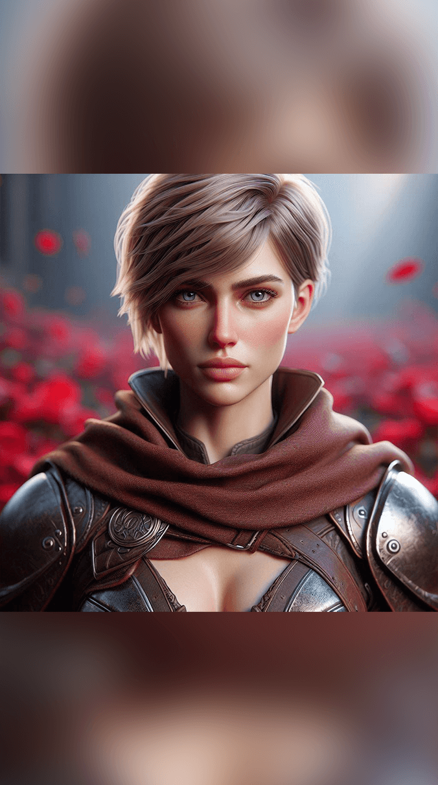
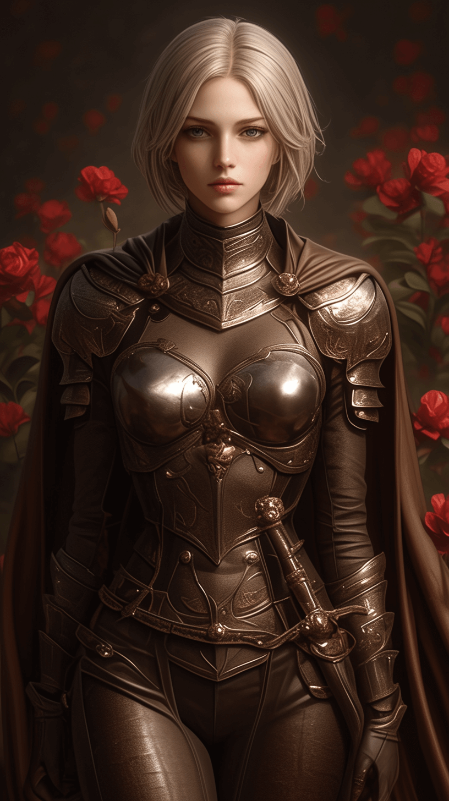
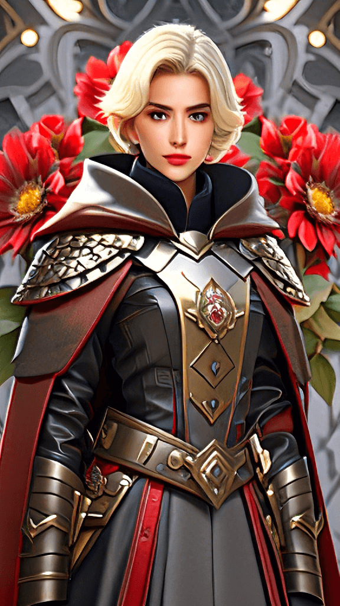
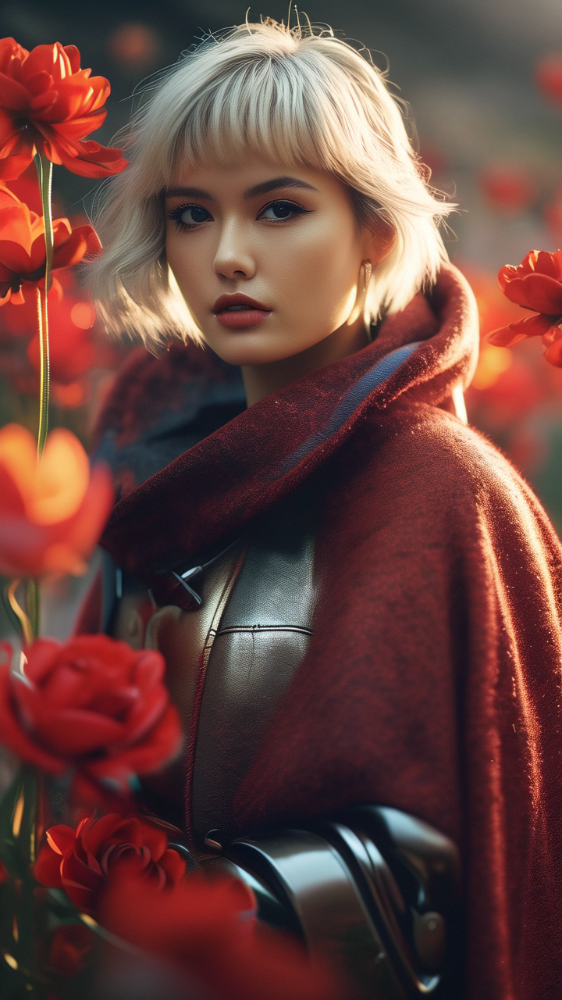
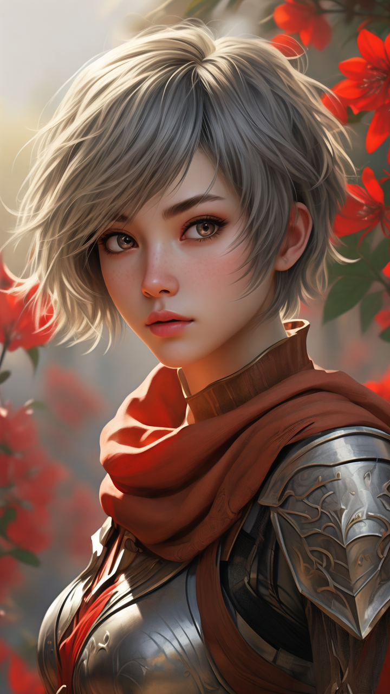
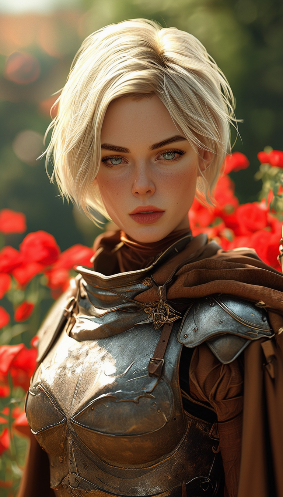

# Awesome AI image  [](https://awesome.re) [](https://makeapullrequest.com) 


> A list of awesome AI image online tools, free to try at least.

## Contents

- [🤖 Text to Image Generator](#text-to-image-generator)
- [🎨 Showcase with Prompt](#showcase-with-prompt)

## Text to Image Generator

- [Midjourney](https://www.midjourney.com/app/)  -  The first success AI image generator product.
- [Bing Image Creator](https://cn.bing.com/images/create)  -  A DALL· E's AI image generation tool by Microsoft Bing.
- [悠船 YouchuanAI](https://www.youchuanai.com/)     - A Chinese Commercial AI image generator app.
- [ideogram.ai](https://ideogram.ai/)    - With reliable text rendering capabilities.
- [Dreamina](https://dreamina.jianying.com/)    - Power by Bytedance.
- [奇域 qiyu](https://www.qiyuai.net/)    - Focus on Chinese style, power by XiaoHuangShu.
- [通义万相 wanxiang](https://tongyi.aliyun.com/wanxiang/)    - Power by Alibaba.
- [文心一格 yige](https://yige.baidu.com/)    - Power by Baidu.
- [哩布](https://www.liblib.art/lib3)    - Support lots of Model and SD3 Beta

### Example

All example use these prompt words, from CatJourney.

> Prompt

```
human woman with short hair, light blonde hair, grey eyes, wearing a leather armor partially covered by a brown cape, serious and determined facial expression, red flowers around, symetric, dynamic pose, Extremely Detailed, Realistic, full body hero, Full view, bright sunlight, unreal render, ultra realistic digital art, hyper realistic, 160 mm lens, soft rim light, octane render, unreal engine, volumetric lighting, dramatic light, 8k, neon ray tracing, path tracing, volumetric light, optix Cinematic post processing, cinema4d, octane render, optix, volumetric fog, global illumination, photorealism, post processing Photoshop --ar 9:16 --style raw --stylize 750 --niji 6
```
```
短发的人类女人，浅金色的头发，灰色的眼睛，穿着皮甲，部分被棕色斗篷覆盖，严肃而坚定的面部表情，周围的红色花朵，对称，动态姿势，极其详细，逼真，全身英雄，全视图，明亮的阳光，虚幻渲染，超写实的数字艺术，超写实，160毫米镜头，柔和的边缘光，辛烷值渲染， 虚幻引擎， 体积光照， 戏剧性光， 8k， 霓虹灯光线追踪， 路径追踪， 体积光， optix 电影后期处理， cinema4d， 辛烷值渲染， optix， 体积雾， 全局照明， 照片级真实感， 后期处理 Photoshop
```
> Negative Prompt (option)

```
(worst quality, low quality, illustration, 3d, 2d, painting, cartoons, sketch),lowres,normal quality,worstquality,EasyNegative,FastNegativeV2,pubic hair,bad body,deformed,mutated,mutation,ugly,text,logo,poorly drawn hands,mutated hands and fingers,mutated hands,bad hands,malformed hands,too many fingers,missing fingers,fused fingers,extra legs,extra limb,extra arms,disconnected limbs,floating limbs,malformed limbs,missing limb,cross-eyed,bad feet,poorly drawn face,disfigured
```

|Midjourney|Bing Image Creator|悠船 YouchuanAI|ideogram.ai|
|:---------------|:------------------------|:------------------------|:-----------------|
|||||

|Dreamina|奇域 qiyu|通义万相 wanxiang|文心一格 yige|
|:---------------|:------------------------|:------------------------|:-----------------|
|||||

|哩布(SD3)| | | |
|:---------------|:------------------------|:------------------------|:-----------------|
|||||


## Showcase with Prompt

- [Civitai](https://civitai.com/images/)  - No.1 AI Image Models Website
- [哩布 Liblib](https://www.liblib.art/inspiration)  - No.1 AI Image Models Website in China
- [Kalos Art lib](https://lib.kalos.art/)  - Your Ultimate AI Artistic Style Library
- [Lexica](https://lexica.art/)  - Search and Generate AI images
- [Prompt Folder](https://promptfolder.com/midjourney-prompt-helper/)  - Midjourney Prompt Generator
- [Prompt Mania](https://promptomania.com/)  - AI art community with an online prompt builder
- [Cat Journey](https://catjourney.life/)  - Amazing AI images and prompt

### More AI Prompts Websites

- [Prompt Hero](https://prompthero.com/)  - Maybe the biggest prompt website
- [Prompt Base](https://promptbase.com/)  - Sell your prompts online

### More Prompts Online Tools
- [Sex Prompts](https://betterwaifu.com/novelai-sex-prompts/)  - A lot of pose keyword 🔞
- [Clip Interrogator](https://replicate.com/pharmapsychotic/clip-interrogator)  - a prompt engineering tool to optimize text prompts to match a given image
- [CLIP Interrogator 2.1](https://www.anysue.com/interrogator.html)  - a other service site
